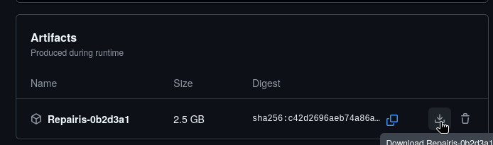

# RepaIRIS
RepaIRIS is a lightweight Linux distribution designed for system repair and maintenance. It is based on NixOS and includes a variety of tools and utilities for diagnosing and fixing common issues.

--------------------------------------------------------
## Features
- Built-in desktop environment (XFCE)
- Uses NetworkManager for network configuration
- Includes a variety of tools and utilities for diagnosing and fixing common issues
- Any additional software can be installed temporarily using Nix(OS)'s `nix-shell` command.
- Comes with Fish shell as the interactive shell. (Bash is also available)
- Fully open-source (GPL 3.0 License, all code used to build the ISO is available here!)

## How to Use
The RepaIRIS ISO is made to be booted off of. It should be used on a flash drive with [Ventoy](https://www.ventoy.net/en/index.html).

## Prerequisites
- A machine with a USB port (USB 3.0 or higher recommended) and Internet access.
- A sort of drive that can hold the ISO. (It's recommended to have a dedicated flash drive of 16GB, anything higher is good)

## Installation
- Install Ventoy using their [official guide](https://www.ventoy.net/en/doc_start.html).
> [!NOTE]
> If you have Nix installed, you can use `nix-shell` to temporarily install Ventoy using `nix-shell -p ventoy-full` and running `sudo ventoy-web`.
>
> Note that you will need to have told Nix that proprietary software and "unsafe" software should be allowed on your computer. You can run `export NIXPKGS_ALLOW_UNFREE=1 && export NIXPKGS_ALLOW_INSECURE=1` and re-run `nix-shell -p ventoy-full`.
- Download the newest version of RepaIRIS by going to the [latest release page](https://github.com/FormunaGit/RepaIRIS/releases/latest), heading over to the ISO artifact link and downloading the zip file that should look like this:

- Export the downloaded zip file and copy the ISO file to your new Ventoy drive.
- Now, boot from the Ventoy drive and select the RepaIRIS ISO to boot into RepaIRIS!

## Contributing
Did I use any bad practices in my code? I probably did. This is my first project that uses GitHub Actions, besides any of my websites. (Vercel builds them anyways)

Locally building the ISO is easy, inside of the repo, run:
```bash
nix build path:$PWD
```
If you get an error similar to any of these:

`fish: Unknown command: nix`

`bash: nix: command not found`

This means Nix isn't installed. In this case, [install Nix.](https://nixos.org/download/)
> Small note to Windows users, you *must* have WSL installed, since Nix doesn't support Windows, although they do support WSL. Any distro will suffice.

If you're on NixOS and you get one of those errors, you have some bigger problems to worry about...
